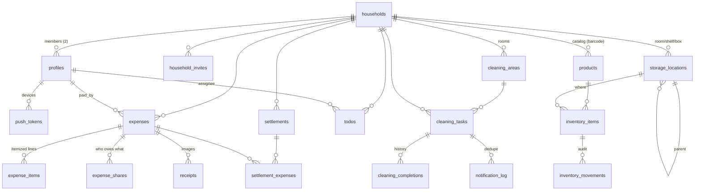

# Haushalt — Data Model & Architecture Proposal

Status: **implemented**. This is the design write-up; the schema itself lives in
`supabase/migrations/` and is verified by `npm run test:db`. Where implementation
diverged from the original proposal, [§16](#16-what-changed-during-implementation)
says so.

Target: one household, two members, Expo + Supabase, realtime everywhere, no custom server.

---

## 1. Design principles

1. **`household_id` on every row.** Even where it's derivable via a parent (e.g. `expense_items` → `expenses`). This makes every RLS policy identical and one-line, every realtime subscription filterable with `household_id=eq.<id>`, and every index simple. The denormalization risk is eliminated with **composite foreign keys** (see §3).
2. **No Postgres `enum` types.** Text columns with `CHECK (x IN (...))`. Adding a value later is a one-line migration instead of `ALTER TYPE` gymnastics, and the dump stays trivially portable to any plain Postgres.
3. **Money = `bigint` cents**, never float, never `numeric` for amounts. Column names end in `_cents` so it's impossible to misread. Currency stored per household (default `EUR`).
4. **Business logic that users see lives in TypeScript; logic that protects integrity lives in Postgres.** Split calculation is a pure, unit-tested TS function; the DB enforces `sum(shares) = total` and RLS. Multi-step state changes (settle up, complete a cleaning task) are `SECURITY INVOKER` RPCs so they're atomic and emit a single realtime event.
5. **Standard Postgres only.** `pgcrypto` for `gen_random_uuid()` (built into PG13+ anyway), `pg_cron` + `pg_net` only for the scheduler. No Supabase-specific SQL beyond `auth.uid()` and the storage policies, both isolated in their own migration files.

---

## 2. Entity relationship overview



---

## 3. Shared conventions

Every table gets:

| Column | Type | Notes |
| --- | --- | --- |
| `id` | `uuid primary key default gen_random_uuid()` | |
| `household_id` | `uuid not null references households(id) on delete cascade` | RLS anchor |
| `created_at` | `timestamptz not null default now()` | |
| `updated_at` | `timestamptz not null default now()` | maintained by `set_updated_at()` trigger |
| `created_by` | `uuid references profiles(id) on delete set null` | on user-authored rows |

**Composite FK pattern** — keeps the denormalized `household_id` provably consistent:

```sql
alter table expenses add constraint expenses_id_household_key unique (id, household_id);

create table expense_items (
  id            uuid primary key default gen_random_uuid(),
  household_id  uuid not null,
  expense_id    uuid not null,
  ...
  foreign key (expense_id, household_id)
    references expenses (id, household_id) on delete cascade
);
```

A child row physically cannot point at a parent from another household.

---

## 4. Core: household, identity, RLS

### `households`
`id`, `name`, `timezone text not null default 'Europe/Berlin'`, `currency char(3) default 'EUR'`, `reminder_hour smallint default 18` (local hour for cleaning pushes), `notify_both_on_overdue boolean default true`, `created_at`, `created_by`.

### `profiles` (1:1 with `auth.users`)
`id uuid primary key references auth.users(id) on delete cascade`, `household_id uuid references households(id)` *(nullable until they join)*, `display_name`, `avatar_url`, `color` (used for the balance/rotation UI), `created_at`, `updated_at`.

Auto-created by an `on auth.users insert` trigger (`handle_new_user()`), so a fresh signup always has a profile row.

> **Decision:** membership is a single `profiles.household_id` column rather than a `household_members` join table. For two people in one household the join table only buys multi-household support you said you don't need, and it costs an extra lookup in the hottest code path there is (every RLS check). If you ever want multi-household, the migration is mechanical — I'll keep all membership reads behind one SQL function so exactly one place changes.

### `household_invites`
`id`, `household_id`, `code text unique not null` (6 chars, human-typeable), `created_by`, `expires_at`, `accepted_by`, `accepted_at`. Your wife signs up → enters the code → `accept_invite(code)` RPC sets her `household_id`. Guarded so a household never exceeds 2 members unless you raise the cap (`households.max_members smallint default 2`).

### The RLS keystone

```sql
create or replace function public.current_household_id()
returns uuid
language sql stable security definer
set search_path = public, pg_temp
as $$ select household_id from public.profiles where id = auth.uid() $$;
```

`security definer` is required: without it, the function's own `select` on `profiles` would re-trigger the `profiles` RLS policy that calls this function → infinite recursion. This is the one place we bypass RLS, and it reads exactly one row keyed by `auth.uid()`.

Every feature table then gets the same four policies:

```sql
alter table todos enable row level security;

create policy todos_select on todos for select
  using (household_id = public.current_household_id());
create policy todos_insert on todos for insert
  with check (household_id = public.current_household_id());
create policy todos_update on todos for update
  using (household_id = public.current_household_id())
  with check (household_id = public.current_household_id());
create policy todos_delete on todos for delete
  using (household_id = public.current_household_id());
```

`profiles` is the exception: `select` for anyone in the same household, `update` only for `id = auth.uid()`.

All views are declared `with (security_invoker = true)` so RLS applies to the *caller*, not the view owner. Without this flag a view is a silent RLS bypass.

---

## 5. Feature 1 — Expense splitting

### `expenses`
`id`, `household_id`, `paid_by uuid not null references profiles(id)`, `title`, `note`, `category text`, `total_cents bigint not null check (total_cents > 0)`, `currency char(3)`, `purchased_at timestamptz not null default now()`, `split_type text not null check (split_type in ('equal','shares','items'))`, `status text not null default 'open' check (status in ('open','settled'))`, `settled_at`, `created_by`, timestamps.

### `expense_items` (optional itemization)
`id`, `household_id`, `expense_id`, `position int`, `name`, `quantity numeric(10,3) default 1`, `unit_price_cents bigint`, `total_cents bigint not null`, `paid_for uuid references profiles(id)` — **null = shared item, split equally**; set = that person alone owes it. This is what drives `split_type = 'items'`.
`source text default 'manual' check (source in ('manual','ocr'))` — so an OCR-parsed line is distinguishable from a hand-typed one.

### `expense_shares` — the single source of truth for balances
`id`, `household_id`, `expense_id`, `profile_id`, `share_cents bigint not null check (share_cents >= 0)`, `share_ratio numeric(6,5)` (only meaningful for `split_type='shares'`, kept for display/editing).
`unique (expense_id, profile_id)`.

Enforced by a constraint trigger (deferred to end of transaction, so the app can insert expense + items + shares in one batch):

```sql
create constraint trigger expense_shares_sum_check
  after insert or update or delete on expense_shares
  deferrable initially deferred
  for each row execute function public.assert_expense_shares_balance();
```

`assert_expense_shares_balance()` raises unless `sum(share_cents) = expenses.total_cents`. **This is why the DB can't drift**, no matter which client version wrote the row.

**Rounding rule** (in the shared TS function `computeShares()`): integer-divide, then distribute the remaining 1–2 cents deterministically, starting with the payer. 10.01 € split 50/50 → payer 501, other 500. Deterministic, reproducible, sums exactly.

### `receipts`
`id`, `household_id`, `expense_id`, `storage_path text not null`, `mime_type`, `size_bytes`, `width`, `height`, `uploaded_by`, `created_at`, plus the OCR extension point:
`ocr_status text not null default 'pending' check (ocr_status in ('pending','processing','done','failed','skipped'))`, `ocr_provider text`, `ocr_raw jsonb`, `ocr_parsed jsonb`, `ocr_error text`, `ocr_completed_at`.

Storage bucket `receipts` (private). **Path convention is load-bearing**: `{household_id}/{expense_id}/{uuid}.jpg`, because the storage policy authorizes on the first path segment:

```sql
create policy "receipts read own household" on storage.objects for select
  using (
    bucket_id = 'receipts'
    and (storage.foldername(name))[1]::uuid = public.current_household_id()
  );
```

**OCR ships as an interface + stub, not a blocker:**
```ts
export interface ReceiptOcrProvider {
  readonly name: string;
  parse(input: { signedUrl: string; mimeType: string }): Promise<ParsedReceipt>;
}
export interface ParsedReceipt {
  merchant?: string; purchasedAt?: string; totalCents?: number; currency?: string;
  lines: Array<{ name: string; quantity?: number; unitPriceCents?: number; totalCents: number }>;
  confidence: number; raw: unknown;
}
```
Edge Function `ocr-receipt` implements the plumbing (fetch signed URL → provider → write `ocr_parsed` → set status) with a `NoopOcrProvider` that returns `{ lines: [], confidence: 0 }` and marks `skipped`. Dropping in Google Vision / Taggun / a local model later is one file.

### `settlements` + `settlement_expenses`
`settlements`: `id`, `household_id`, `from_profile`, `to_profile`, `amount_cents`, `method text check (method in ('cash','transfer','paypal','other'))`, `note`, `settled_at`, `created_by`.
`settlement_expenses`: `(settlement_id, expense_id)` PK + `household_id`.

RPC `settle_up(p_expense_ids uuid[], p_method text, p_note text)` — atomically creates the settlement, links the expenses, flips them to `status='settled'`, stamps `settled_at`. One transaction, one realtime burst.

> **Decision:** settlements close *whole* expenses rather than being ledger entries of arbitrary amounts. That directly matches your "settlement status (open/settled)" requirement and makes the balance exact by construction. Trade-off: no partial payments ("here's 20 € off the 25 € I owe"). If you want those, say so now — it means dropping `status` for a pure ledger where balance = Σ(all entries) and nothing is ever closed. I'd rather not; the closed-expense model is much easier to reason about at 2 people.

### Balance view

```sql
create view v_household_balances with (security_invoker = true) as
select p.household_id, p.id as profile_id,
       coalesce(paid.cents, 0)  as paid_cents,
       coalesce(owed.cents, 0)  as owed_cents,
       coalesce(paid.cents, 0) - coalesce(owed.cents, 0) as net_cents
from profiles p
left join lateral (...) paid on true
left join lateral (...) owed on true;
```
Only `status='open'` expenses count. Nets always sum to zero. The UI reads one row: `net_cents > 0` → "Nico bekommt 24,50 €".

---

## 6. Feature 2 — Shared to-do list

### `todos`
`id`, `household_id`, `title text not null`, `notes`, `assignee_id uuid references profiles(id)` (nullable = anyone), `due_date date`, `is_done boolean not null default false`, `done_at`, `done_by`, `position numeric` (fractional indexing → drag-reorder without rewriting every row), `created_by`, timestamps.

Deliberately boring. Realtime + optimistic checkbox, hard delete (with an undo snackbar client-side rather than a `deleted_at` column).

---

## 7. Feature 3 — Putzplan (top priority)

### `cleaning_areas`
`id`, `household_id`, `name` ("Bad", "Küche", "Schlafzimmer"), `icon text`, `color text`, `sort_order int`. Drives the grouping and colour language of the flagship screen.

### `cleaning_tasks`

| Column | Purpose |
| --- | --- |
| `name`, `description`, `area_id`, `estimated_minutes` | what & where |
| `recurrence_unit text check (in ('day','week','month'))` + `recurrence_interval int` | "every X days / weeks / months" |
| `weekdays smallint[]` | optional, weekly tasks pinned to e.g. Sat = `{6}` |
| `day_of_month smallint` | optional, monthly tasks on the Nth |
| `schedule_mode text check (in ('fixed','after_completion'))` | **see below** |
| `assignment_mode text check (in ('fixed','rotating'))` | |
| `assigned_to uuid` | current responsible person (also the rotation cursor) |
| `rotation_order uuid[]` | ordered profile ids; rotation advances on completion |
| `next_due_on date not null` | materialized — the cron and the agenda both read only this |
| `last_completed_at`, `last_completed_by` | |
| `remind_days_before smallint default 0`, `reminder_enabled boolean default true` | |
| `is_active boolean default true`, `sort_order`, `created_by`, timestamps | |

> **`schedule_mode` is the detail that makes or breaks a Putzplan.** `fixed`: "bathroom every Saturday" — next due advances from the *scheduled* date, so doing it Sunday doesn't shift the whole series. `after_completion`: "vacuum every 7 days" — next due = completion date + 7, because doing it late means the next one is genuinely later. Both are one field and one branch in `cleaning_next_due()`; picking only one would be wrong half the time.

### `cleaning_completions` (history)
`id`, `household_id`, `task_id`, `completed_by`, `completed_at`, `due_on` (what it was due for — enables "done 3 days late" stats), `duration_minutes`, `note`.

Gives you a fairness view for free: `v_cleaning_stats` (completions per person per month). Good material for the polished screen.

### Server-side date logic
```sql
create function public.cleaning_next_due(t cleaning_tasks, from_date date) returns date
```
Pure, deterministic, plpgsql, ~40 lines. Used by both `complete_cleaning_task()` and the seed data, so the app and the cron can never disagree about what "next Tuesday" means.

RPC `complete_cleaning_task(p_task_id uuid, p_completed_at timestamptz default now(), p_note text default null)`:
1. insert `cleaning_completions` row,
2. `next_due_on := cleaning_next_due(task, ...)`,
3. rotate `assigned_to` to the next entry in `rotation_order` when `assignment_mode='rotating'`,
4. clear the pending `notification_log` entry for that due date.

Atomic → one `UPDATE` broadcast → your wife's phone re-renders instantly.

### Agenda view
`v_cleaning_agenda` (`security_invoker`) adds `days_until = next_due_on - (now() at time zone household.timezone)::date` and a derived `status`: `overdue` / `due_today` / `due_soon` (≤2d) / `upcoming`. The screen is a single query, sorted by `next_due_on`.

---

## 8. Feature 4 — Inventory with barcode scanning

### `storage_locations` (self-referencing hierarchy)
`id`, `household_id`, `parent_id uuid references storage_locations(id)`, `name`, `kind text check (kind in ('room','shelf','box','fridge','freezer','cabinet','other'))`, `sort_order`. Room → Schrank → Kiste, arbitrary depth. A recursive CTE view `v_location_paths` renders "Keller › Regal 2 › Kiste A" for the picker.

### `products` (household catalog — the scan target)
`id`, `household_id`, `barcode text` (EAN-8/13/UPC, nullable for unbarcoded items), `name`, `brand`, `category`, `unit text check (unit in ('piece','g','kg','ml','l','pack'))`, `net_quantity numeric`, `image_path`, `default_location_id`, `notes`, `source text check (source in ('manual','scan','external'))`, `external_provider text`, `external_id text`, `external_payload jsonb`, timestamps.
`unique (household_id, barcode) where barcode is not null`.

### `product_lookup_cache` — **the extension point**
`barcode text primary key`, `provider text`, `payload jsonb`, `fetched_at`, `hit_count`. Not household-scoped (product facts are global), readable by any authenticated user, writable only by the service role.

Scan flow, all four steps already wired, only step 3 stubbed:
```
scan (expo-camera) → local products by barcode?  → yes: increment quantity, done
                   → no: product_lookup_cache?   → yes: prefill create-product sheet
                   → no: Edge Function `lookup-barcode` → provider registry
                                                          (NullProvider today,
                                                           OpenFoodFacts/GS1 later)
                   → still nothing: manual entry sheet, prefilled with the barcode
```
`lookup-barcode` has the same shape as the OCR provider: an array of `BarcodeProvider`s tried in order, first hit cached. Adding Open Food Facts later is ~30 lines and zero schema change.

### `inventory_items` (quantity on hand, per location)
`id`, `household_id`, `product_id`, `location_id`, `quantity numeric(12,3) not null default 0`, `unit`, `min_quantity numeric` (low-stock threshold), `expires_on date`, `opened_at`, `note`, timestamps.
`unique (product_id, location_id, coalesce(expires_on,'infinity'))` — same product in Keller *and* Küche = two rows, which is exactly the "how much of what, and where" you asked for. `v_inventory_totals` sums across locations for the "do we still have coffee?" question.

### `inventory_movements` (audit trail)
`id`, `household_id`, `item_id`, `product_id`, `delta numeric not null`, `reason text check (reason in ('scan_in','manual_adjust','consume','move','correction','initial'))`, `from_location_id`, `to_location_id`, `created_by`, `created_at`.

Cheap to write, and it's what makes concurrent edits from two phones debuggable ("who took the last one?"). `quantity` stays denormalized on `inventory_items` for fast reads; movements are the log, written in the same RPC.

---

## 9. Notifications

### `push_tokens`
`id`, `household_id`, `profile_id`, `token text unique not null` (ExponentPushToken[...]), `platform text check (platform in ('ios','android'))`, `device_name`, `last_seen_at`, `disabled_at`. **Per-device, not per-user** — you'll have a phone and probably a tablet, and a stale token must be prunable without logging anyone out.

### `notification_log` — dedupe + delivery tracking
`id`, `household_id`, `task_id`, `profile_id`, `kind text check (kind in ('due','overdue','digest'))`, `due_on date`, `sent_at`, `expo_ticket_id`, `expo_receipt_status`, `error`.
`unique (task_id, profile_id, kind, due_on)` — **this unique index is the entire anti-spam mechanism.** The cron can run every hour, crash mid-batch, or be manually re-triggered; you still get exactly one "Bad putzen" push per task per due date per person.

---

## 10. Reminder + keep-alive architecture

### Schedule
`pg_cron` job, **hourly** (`0 * * * *`), calls the Edge Function over HTTP via `pg_net`:

```sql
select cron.schedule('household-tick', '0 * * * *', $$
  select net.http_post(
    url     := 'https://<ref>.functions.supabase.co/household-tick',
    headers := jsonb_build_object('Content-Type','application/json',
                                  'x-cron-secret', current_setting('app.cron_secret', true)),
    body    := '{}'::jsonb,
    timeout_milliseconds := 20000
  );
$$);
```

Hourly (not daily) for two reasons: it honours `households.reminder_hour` in the household's own timezone without hardcoding UTC offsets or worrying about DST, and it gives the keep-alive 24 touches a day instead of 1 — a single daily job that fails twice in a row would put you 2 days closer to the pause.

Deployed with `--no-verify-jwt` and authorized by our own `x-cron-secret` header (compared against a Supabase secret); inside, it uses the `service_role` key to bypass RLS legitimately.

### What one run does

```
household-tick (hourly)
├─ 0. verify x-cron-secret                       → 401 otherwise
├─ 1. KEEP-ALIVE (always, before anything else, never skipped)
│     • select from households/cleaning_tasks    ← read through PostgREST
│     • upsert system_heartbeat (ran_at, …)      ← write through PostgREST
├─ 2. for each household: local_now = now() AT TIME ZONE household.timezone
├─ 3. if local_now.hour == household.reminder_hour:
│       due   = tasks where next_due_on <= local_today + remind_days_before
│       overdue = tasks where next_due_on <  local_today
├─ 4. recipients = assigned_to  (+ both members if overdue and notify_both_on_overdue)
├─ 5. anti-dupe: insert into notification_log ON CONFLICT DO NOTHING
│                → only rows that actually inserted get a push
├─ 6. fetch push_tokens (disabled_at is null), chunk by 100,
│     POST https://exp.host/--/api/v2/push/send, store ticket ids
└─ 7. second pass: for tickets sent >15 min ago, GET Expo receipts;
      DeviceNotRegistered → set push_tokens.disabled_at (self-healing)
```

### Why the keep-alive lives *in the Edge Function*, not in a plain SQL cron job

This is the part worth being precise about. Supabase pauses free projects after ~7 days of inactivity. A `pg_cron` job that only runs SQL executes *inside* the database process — it's not an API request, and it is not something I'd bet the project's uptime on counting as "activity." So the heartbeat is a **real PostgREST round-trip made by the Edge Function using `@supabase/supabase-js`**: an outside-in HTTP request to the project's API, plus a write, on every single run. That's unambiguously project activity.

Belt and braces: step 1 runs **before** the reminder logic and is wrapped in its own try/catch, so even if every household's reminder computation throws, the keep-alive has already happened. `system_heartbeat` (`id`, `ran_at`, `run_kind`, `households_scanned`, `notifications_sent`, `duration_ms`, `error`) doubles as your cron observability — one query tells you whether the scheduler has been alive all week.

### Client side
- On login: request permission → `getExpoPushTokenAsync()` → upsert into `push_tokens` (Android needs a notification channel created first).
- Tap handler deep-links to `/putzplan/[taskId]` via expo-router.
- Foreground handler shows an in-app banner instead of a system notification.

> ⚠️ **Constraint you should know now:** remote push notifications **do not work in Expo Go** (removed in SDK 53). The Putzplan reminders require a **development build** (`eas build --profile development` or a local `expo run:android`). Everything else — realtime, camera, barcode scanning — works fine in Expo Go, so we can develop 90% of the app there and only need the dev build for push testing. Android dev builds are free to produce locally; iOS needs an Apple Developer account.

---

## 11. Realtime setup

```sql
alter publication supabase_realtime add table
  todos, expenses, expense_items, expense_shares, receipts, settlements,
  cleaning_tasks, cleaning_completions, cleaning_areas,
  inventory_items, products, storage_locations, profiles;

alter table todos replica identity full;   -- and each of the above
```

`replica identity full` is **required**, not optional: with RLS enabled, Postgres only ships the primary key on `DELETE` by default, so Realtime can't evaluate your policy against the deleted row and simply drops the event. You'd get "deleting a to-do doesn't disappear on the other phone" — a bug that looks like a client problem and isn't.

Client design: **one channel per household**, `household:<uuid>`, carrying several `postgres_changes` listeners each filtered `household_id=eq.<uuid>`. One websocket, not twelve. A generic `useRealtimeTable(table, queryKey)` hook patches the TanStack Query cache in place (insert/update/delete) rather than refetching, so updates land in well under a second, and falls back to `invalidateQueries` on reconnect to heal any gap.

---

## 12. Migration file plan

```
supabase/migrations/
  20260729120000_extensions.sql            -- pgcrypto, helper: set_updated_at()
  20260729120100_households_profiles.sql   -- households, profiles, invites, handle_new_user()
  20260729120200_rls_core.sql              -- current_household_id(), policies on core
  20260729120300_expenses.sql              -- expenses, items, shares, receipts, settlements + RLS
  20260729120400_todos.sql
  20260729120500_cleaning.sql              -- areas, tasks, completions, cleaning_next_due()
  20260729120600_inventory.sql             -- locations, products, items, movements, lookup cache
  20260729120700_notifications.sql         -- push_tokens, notification_log, system_heartbeat
  20260729120800_views.sql                 -- balances, agenda, inventory totals, stats
  20260729120900_rpcs.sql                  -- settle_up, complete_cleaning_task, accept_invite, scan_in
  20260729121000_storage.sql               -- receipts bucket + object policies
  20260729121100_realtime.sql              -- publication + replica identity
  20260729121200_seed_dev.sql              -- optional demo data, guarded
```

Ordered, idempotent where sensible, runnable top-to-bottom on a virgin Postgres.

---

## 13. App structure

```
app/                          # expo-router
  (auth)/sign-in.tsx, join-household.tsx
  (tabs)/putzplan/            # ← flagship
  (tabs)/ausgaben/
  (tabs)/todos/
  (tabs)/inventar/
src/
  lib/supabase.ts             # typed client, AsyncStorage session, autoRefresh
  lib/database.types.ts       # generated: supabase gen types typescript
  lib/realtime.ts             # useRealtimeTable, household channel manager
  lib/notifications.ts        # permission, token registration, tap routing
  lib/money.ts                # cents formatting/parsing
  features/expenses/          # api.ts, hooks.ts, split.ts (+ split.test.ts), components/
  features/todos/
  features/cleaning/          # recurrence.ts mirrors cleaning_next_due()
  features/inventory/         # scanner.ts, lookup providers
supabase/functions/
  household-tick/             # cron: reminders + keep-alive
  lookup-barcode/             # provider registry, stub
  ocr-receipt/                # provider interface, noop stub
```

---

## 14. Assumptions I've made

1. Locale `de-DE`, currency EUR, timezone Europe/Berlin, week starts Monday. UI language German (it's a Putzplan), code/comments English.
2. Exactly 2 members, enforced by a cap — but nothing in the schema breaks at 3+ except the balance UI copy.
3. Auth = email + password (magic links need deep-link config; happy to switch).
4. TanStack Query for server state, no Redux.
5. Receipts stored at ~1600px JPEG, client-compressed before upload.

## 16. What changed during implementation

Four things came out differently than proposed. All of them were forced by something
real rather than chosen.

**1. Expenses must be created through an RPC.** The proposal had the client writing
`expenses` and `expense_shares` in one transaction. It cannot: PostgREST gives you one
statement per request, so the two inserts are two transactions and the deferred balance
constraint rejects the first one every time. The schema test caught this immediately —
the invariant fired exactly as designed and made the flaw in the plan obvious.
`create_expense()` / `update_expense()` / `apply_expense_split()` were added, and the
split rules (equal / custom shares / per item) now live in SQL with a mirrored
TypeScript implementation used only for the live preview.

**2. A `push_receipts` table was added.** Expo accepts a push immediately (a "ticket")
and only reports actual delivery minutes later (a "receipt"). One `notification_log`
row fans out to several devices, so tickets could not be stored on it. Without this
table, dead tokens could not be traced back to the device that produced them, and the
self-healing described in §10 would not work.

**3. Realtime invalidates queries instead of patching the cache.** §11 proposed
patching rows in place. That is wrong for this schema: the Putzplan and the balance
card read *views*, whose row shape is not the row shape of the table that changed.
Patching would mean re-deriving `status`, `days_until` and every balance on the client
— a second implementation of logic Postgres already owns, free to drift from it. A
prefix invalidation costs one small refetch and is always correct. The two interactions
that must feel instant (ticking a chore, checking a to-do) are optimistic locally.

**4. `schedule_mode` defaults to `after_completion`.** The proposal left the default
open. Most chores people actually add ("saugen alle 4 Tage") are interval-based; the
calendar-pinned ones are the minority and are the ones people set deliberately.

Everything else — the tenant model, composite foreign keys, the deferred balance
trigger, cents as `bigint`, the hourly cron with the keep-alive ahead of the reminder
logic, whole-expense settlements, the two-tier product catalog — shipped as described.
